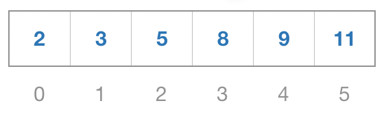

# Оглавление
- [Оглавление](#оглавление)
- [Аннотация](#аннотация)
- [Асимптотическая сложность. О-нотация](#асимптотическая-сложность-о-нотация)
  - [Понятие асимптотической сложности](#понятие-асимптотической-сложности)
  - [Big-O нотация](#big-o-нотация)
  - [Остальные нотации (Ω, Θ)](#остальные-нотации-ω-θ)
    - [Ω (Омега)](#ω-омега)
    - [Θ (Тета)](#θ-тета)
  - [Анализ сложности алгоритмов](#анализ-сложности-алгоритмов)
  - [Худший, средний и лучший случай](#худший-средний-и-лучший-случай)
- [Массивы](#массивы)
  - [Определение, характеристики](#определение-характеристики)
  - [Индексация](#индексация)
  - [Двумерные массивы](#двумерные-массивы)
  - [Статические и динамические массивы](#статические-и-динамические-массивы)
- [Строки](#строки)
  - [Определение](#определение)
  - [Символы и кодировки](#символы-и-кодировки)
  - [Операции со строками](#операции-со-строками)
    - [Конкатенация](#конкатенация)
    - [Интерполяция](#интерполяция)
    - [Доступ к символам](#доступ-к-символам)
    - [Поиск подстроки / символа](#поиск-подстроки--символа)
  - [Сравнение строк](#сравнение-строк)
- [Связныe списки](#связныe-списки)
  - [Определение](#определение-1)

# Аннотация
Этот репозиторий представляет собой собрание изучаемых алгоритмов и основных структур данных. Примеры данной работы описаны на языке программирования Kotlin. Каждый элемент включает краткое описание и примеры, а также ссылки на дополнительные ресурсы для более глубокого понимания темы.
# Асимптотическая сложность. О-нотация
## Понятие асимптотической сложности

> *Асимптотическая сложность - это концепция в теории вычислительной сложности, которая описывает поведение алгоритма при увеличении размера входных данных. Она позволяет нам сравнивать эффективность различных алгоритмов независимо от конкретных значений входных данных.*

В общем виде, асимптотическая сложность алгоритма определяется как функция, которая описывает количество операций, которые должен выполнить алгоритм, в зависимости от размера входных данных. Эта функция обычно обозначается как O(n), где n - это размер входных данных.  

Асимптотическая сложность может быть выражена в терминах больших O, Ω (Омега) и Θ (Тета). Большие O используются для верхней границы сложности, Ω - для нижней границы, а Θ - когда верхняя и нижняя границы совпадают.

Например, если мы говорим, что алгоритм имеет асимптотическую сложность O(n^2), это означает, что время выполнения алгоритма будет расти **квадратично** с увеличением размера входных данных. Если же мы говорим, что алгоритм имеет асимптотическую сложность O(log n), это означает, что время выполнения алгоритма будет расти **логарифмически** с увеличением размера входных данных.

[Изучить подробнее](https://www.geeksforgeeks.org/types-of-asymptotic-notations-in-complexity-analysis-of-algorithms/)

## Big-O нотация

> *Big-O нотация представляет собой математическое выражение, описывающее ограничение сверху скорости роста функции, которая определяет количество операций, выполняемых алгоритмом*

Основная цель Big-O нотации - предоставить инструмент для сравнения эффективности различных алгоритмов. Это позволяет программистам выбирать наиболее эффективный алгоритм для конкретной задачи, учитывая объем данных, с которыми он будет работать.

Вот некоторые общие типы временной сложности и соответствующие им Big O нотации:

- **O(1)**: Константная временная сложность. Это наилучший случай, когда время выполнения алгоритма не зависит от размера входных данных. Примером может служить доступ к элементу массива по индексу.

- **O(log n)**: Логарифмическая временная сложность. Это хорошо, когда размер входных данных уменьшается вдвое с каждым шагом, например, при бинарном поиске.

- **O(n)**: Линейная временная сложность. Это происходит, когда вы имеете один цикл в вашем алгоритме. Примером может служить простой перебор всех элементов массива.

- **O(n log n)**: Временная сложность, которую можно найти в алгоритмах сортировки, таких как сортировка слиянием и быстрая сортировка.

- **O(n^2)**: Квадратичная временная сложность. Это происходит, когда у вас есть вложенные циклы в вашем алгоритме. Примером может служить алгоритм пузырьковой сортировки.

- **O(2^n)**: Экспоненциальная временная сложность. Это происходит, когда время выполнения алгоритма удваивается с каждым новым элементом входных данных. Примером может служить алгоритм перебора подмножеств.
  
Важно помнить, что эти нотации описывают только верхнюю границу времени выполнения алгоритма, то есть максимальное возможное время выполнения.

[Изучить подробнее](https://www.geeksforgeeks.org/analysis-algorithms-big-o-analysis/)

## Остальные нотации (Ω, Θ)
### Ω (Омега)
> *Нотация Ω определяет **нижнюю** границу роста времени выполнения алгоритма.* 

Это указывает на минимальное количество операций, которое алгоритм должен выполнить при заданных размерах входных данных.

- **Оценка лучшего случая**: Нотация Ω дает представление о минимальном времени выполнения алгоритма при данном размере входных данных.

- **Пример**: Если алгоритм имеет время выполнения Ω(n), это означает, что как минимум n операций будут выполнены для входных данных размера n.

[Изучить подробнее](https://www.geeksforgeeks.org/analysis-of-algorithms-big-omega-notation)

### Θ (Тета)
> *Нотация Θ обозначает **среднюю** оценку времени выполнения алгоритма, определяя как нижнюю, так и верхнюю границы его выполнения.*

- **Оценка лучшего случая**: Нотация Θ указывает, что алгоритм выполняется "примерно столько же, сколько и Ω, но не более, чем O.

- **Пример**: Если время выполнения алгоритма оценивается как Θ(n), это означает, что алгоритм выполняется примерно за линейное время, в пределах заданных размеров входных данных.
  
[Изучить подробнее](https://www.geeksforgeeks.org/analysis-of-algorithms-big-theta-notation)

## Анализ сложности алгоритмов
Определение сложности алгоритма связано с определением количества операций или ресурсов (например, время или память), которые требуются для выполнения этого алгоритма в зависимости от размера входных данных.  

Расчет сложности алгоритма обычно включает в себя следующие шаги:  
1. Определение операций  
   
   Определить базовые операции, которые выполняются в алгоритме. Это может быть простая математическая операция, сравнение, присваивание значения или что-то другое  

**Пример**: Рассмотрим алгоритм поиска максимального элемента в массиве.
```kotlin
fun findMax(arr: IntArray): Int {
    var max = arr[0]       // Присваивание значения - O(1)
    for (value in arr) {    // Цикл - O(n)
        if (value > max) {  // Сравнение - O(1)
            max = value     // Присваивание значения - O(1)
        }
    }
    return max
}
```
2. Оценка  
   
   Проанализировать, сколько раз каждая базовая операция выполняется в зависимости от размера входных данных. Это включает в себя анализ циклов, рекурсивных вызовов или других структур данных в алгоритме.

**Пример**: В предыдущем алгоритме поиска максимального элемента:
- Присваивание начального значения - 1 операция
- Цикл, проходящий по массиву - n операций
  - Сравнение и, при необходимости, присваивание нового значения - по 1 операции

**Расчёт**: O(1 + n * (1 + 1)) = O(1 + 2n) = O(2n) = **O(n)**  

Расчет показывает, что время выполнения данного алгоритма оценивается как O(n), что указывает на линейную зависимость времени выполнения от размера входных данных

[Изучить подробнее](https://www.geeksforgeeks.org/examples-of-big-o-analysis)

## Худший, средний и лучший случай
> *Худший случай (Worst Case) - это сценарий выполнения алгоритма, который приводит к наибольшему времени выполнения или использованию ресурсов из всех возможных входных данных.*

Это наихудший из всех возможных сценариев, когда алгоритм работает медленнее всего или требует наибольшего количества операций.

В большинстве случаев мы проводим анализ наихудших сценариев для анализа алгоритмов. В худшем анализе мы гарантируем верхнюю границу времени работы алгоритма, что является хорошей информацией.

> *Средний случай (Average Case) - это сценарий выполнения алгоритма, который учитывает типичные или средние входные данные и время выполнения в среднем по всем возможным входам.* 

Это усредненная оценка производительности алгоритма по всем возможным входам

В большинстве практических случаев анализ усредненного случая сделать непросто, и он редко проводится. При анализе среднего случая мы должны знать (или предсказывать) математическое распределение всех возможных входных данных.

> *Лучший случай (Best Case) - это сценарий выполнения алгоритма, при котором он достигает наименьшего времени выполнения или использует наименьшее количество ресурсов из всех возможных входных данных.* 

Это оптимальный сценарий, когда алгоритм работает быстрее всего или требует наименьшего количества операций.

Анализ лучшего является фальшивым. Гарантия нижней границы алгоритма не дает никакой информации, так как в худшем случае на выполнение алгоритма могут уйти годы.

**Пример**: Линейный поиск  

- Лучший случай: Лучший случай для линейного поиска наступает, когда искомый элемент находится в начале массива или первым элементом. В этом случае алгоритм совершает всего одно сравнение и заканчивает выполнение, что занимает время O(1).
  
- Худший случай: Худший случай для линейного поиска наступает, когда искомый элемент находится в самом конце массива или отсутствует в массиве. В этом случае алгоритм перебирает все элементы в массиве и выполняет n сравнений (где n - количество элементов), что занимает время O(n).

[Изучить подробнее](https://www.geeksforgeeks.org/worst-average-and-best-case-analysis-of-algorithms)

# Массивы
## Определение, характеристики
  

> *Массив в программировании представляет собой структуру данных, которая хранит элементы одного типа, располагая их последовательно в памяти компьютера.*

Элементы в массиве доступны по их индексам, что облегчает управление данными и обращение к ним.  

Основные характеристики массивов:  
- **Тип данных**: Все элементы массива имеют одинаковый тип данных. Например, массив целых чисел, массив строк, массивы с плавающей точкой и т.д.

- **Индексация**: Элементы в массиве нумеруются начиная с 0 (в случае многих языков программирования). Индекс используется для доступа к элементу в массиве.

- **Фиксированный размер**: Размер массива обычно определяется при его создании и остаётся **неизменным** во время выполнения программы (в некоторых языках есть динамические массивы, которые могут менять размер в процессе работы программы).

- **Эффективность доступа**: Использование индексов позволяет быстро получать доступ к элементам массива. Это делает операции чтения и записи очень эффективными.

[Изучить подробнее](https://www.geeksforgeeks.org/what-is-array/)

## Индексация
> *Индексация в массивах - это способ обращения к отдельным элементам массива по их порядковому номеру или индексу.*

Индексы начинаются с 0 во многих языках программирования. Например, первый элемент массива будет иметь индекс 0, второй - индекс 1 и так далее.  

Индексация позволяет получать доступ к элементам массива и изменять их значения. Она является ключевым аспектом работы с массивами.

Пример: 
```kotlin
val names = arrayOf("Max", "John", "Mike") // Массив с именами
println(arr[0]) // Вывод: Max
println(arr[2]) // Вывод: Mike

names[2] = "Bob" // Изменение значения массива

println(arr[2]) // Вывод: Bob
```

Индексация дает возможность эффективно работать с элементами массива. Она обеспечивает простой доступ к данным и позволяет выполнять различные операции, такие как чтение, запись, удаление и обновление элементов массива.

> Временная сложность индексации в массиве обычно составляет **O(1)**.  
> Это означает, что время доступа к любому элементу в массиве не зависит от размера массива.

[Изучить подробнее](https://www.geeksforgeeks.org/how-exactly-does-indexing-works-in-arrays)

## Двумерные массивы
> *Двумерные массивы - это массивы, которые имеют два измерения: строки и столбцы.*

Индексация в двумерных массивах происходит с использованием двух чисел: первое число обозначает строку, а второе - столбец. Индексы также часто начинаются с нуля.

Пример двумерного массива:
```kotlin
fun main() {
    // Создание двумерного массива
    val 2d_arr = arrayOf(
        intArrayOf(1, 2, 3), // 0
        intArrayOf(4, 5, 6), // 1
        intArrayOf(7, 8, 9) // 2
    )

    // Доступ к элементам массива по индексам
    println(2d_arr[0][0])  // Вывод: 1
    println(2d_arr[1][2])  // Вывод: 6
    println(2d_arr[2][1])  // Вывод: 8
}
```

Индексация в n-мерных массивах работает аналогично, где каждое новое измерение добавляет еще один индекс для доступа к элементу в соответствующей размерности.

[Изучить подробнее](https://www.geeksforgeeks.org/difference-between-one-dimensional-and-two-dimensional-array)

## Статические и динамические массивы
> ***Статический массив** — это коллекция элементов одного типа, размер которой задается заранее и не изменяется во время выполнения программы.*

Статический массив имеет фиксированный размер, который определяется при его создании. Размер статического массива не может быть изменен после его объявления.

Пример статического массива
```kotlin
val staticArray = arrayOf(1, 2, 3, 4, 5)
```  

> *Динамический массив представляет собой коллекцию элементов, размер которой может динамически изменяться во время выполнения программы*

Пример динамического массива
```kotlin
val dynamicArray = mutableListOf<Int>()
dynamicArray.add(1)
dynamicArray.add(2)
dynamicArray.add(3)

// Размер массива может меняться динамически
```

**Размер**
- Статические массивы имеют фиксированный размер, который определяется при создании и не изменяется.
- Динамические массивы могут изменять свой размер по мере необходимости во время выполнения программы.

**Управление памятью**
- Память для статического массива выделяется при его создании и освобождается только при завершении программы.
- Динамические массивы могут менять свой размер, что требует дополнительного управления памятью: при добавлении элементов может происходить выделение дополнительной памяти, а при удалении — её освобождение.

**Гибкость**
- Статические массивы не могут изменять свой размер, что делает их менее гибкими для операций добавления или удаления элементов.
- Динамические массивы обладают гибкостью изменения размера, что делает их удобными для динамических структур данных.

[Изучить подробнее](https://www.geeksforgeeks.org/difference-between-static-arrays-and-dynamic-arrays)

# Строки
## Определение

> ***Строка** - это один из базовых типов данных, представляющий собой последовательность символов, таких как буквы, цифры, знаки препинания и пробелы.*

Строки в программировании часто используются для хранения информации, передачи данных между программами и взаимодействия с пользователем. Например, строки могут быть использованы для хранения имени пользователя, адреса электронной почты, текстовых сообщений и многого другого

Строки в программировании являются **неизменяемыми**. Это означает, что после создания строки ее нельзя изменить, а только создать новую строку на основе существующей

[Изучить подробнее](https://www.geeksforgeeks.org/introduction-to-strings-data-structure-and-algorithm-tutorials)

## Символы и кодировки
**ASCII (American Standard Code for Information Interchange)** была одной из первых широко используемых кодировок символов. 

Она предназначалась для кодирования основных символов английского языка, используя 7 бит (128 уникальных значений) и расширенная версия, которая использовала 8 бит (256 уникальных значений). Это включало в себя буквы, цифры, знаки пунктуации и некоторые специальные символы.

Например, в ASCII буква "A" представляется числом 65, "a" - 97, цифра "0" - 48, и так далее. Это означает, что каждому символу соответствует определенное числовое значение, которое компьютер использует для хранения и передачи информации.

Однако ASCII имеет свои ограничения, так как она ориентирована главным образом на английский язык и не способна вместить все символы других языков, не говоря уже о символах изображений, эмодзи и др.

> [ASCII Table](https://www.asciitable.com/)  
> [Text to ACSII](https://www.browserling.com/tools/text-to-ascii)

**Unicode** была создана для преодоления этих ограничений. Она разработана так, чтобы вместить символы практически всех языков мира, математические символы, специальные символы и даже эмодзи. Unicode использует от 8 до 32 бит для представления символов. Базовая версия использует 16 бит (называемые code units), что дает возможность представлять более 65 тысяч уникальных символов. Расширенные версии Unicode позволяют представлять гораздо больше символов.

Преимущество Unicode заключается в том, что она позволяет представить символы практически всех языков мира и различные символы, используемые в разных областях, включая научные обозначения, математические символы, символы валют и многое другое.

Например, в Unicode буква "Я" представлена значением U+042F, а эмодзи "💜" представлена значением U+1F49C. Это позволяет компьютерам и программам правильно интерпретировать и отображать такое разнообразие символов.

Важно помнить, что при обработке текста необходимо учитывать используемую кодировку, чтобы избежать проблем с отображением и обработкой символов. Переключение между кодировками может привести к неправильному отображению текста или даже потере информации.

> [Unicode Table](https://symbl.cc/en/unicode/table/#cyrillic)  
> [Text to Unicode](https://checkserp.com/encode/unicode/)

[Изучить подробнее](https://www.geeksforgeeks.org/understanding-character-encoding)

## Операции со строками
### Конкатенация
> ***Конкатенация строк** - это операция объединения двух или более строк в одну строку. В результате конкатенации создается новая строка, содержащая символы из всех исходных строк в порядке их объединения.*

В программировании конкатенация строк обычно выполняется с помощью операторов или функций, предоставляемых языком программирования.

Пример конкатенации:
```kotlin
val result = "Hello" + "World!"
println(result) // Вывод: HelloWorld!
```
[Изучить подробнее](https://www.geeksforgeeks.org/concatenating-two-strings-in-c/)
### Интерполяция
> ***Интерполяция строк** - это способ вставки значений переменных или выражений прямо в строку, чтобы формировать новую строку.*

Этот метод позволяет вставлять значения переменных или результаты вычислений внутри текстовых строк, делая код более читаемым и удобным для работы с данными.

Пример интерполяции:
```kotlin
val name = "John"
val age = 30
val message = "My name is $name and I'm $age years old."
println(message) // Вывод: My name is John and I'm 30 years old.
```

В случае необходимости провести вычисления нужно использовать фигурные скобки `{}`.
```kotlin
val a = 10
val b = 5
val result = "The sum of $a and $b is ${a + b}."
println(result) // Вывод: The sum of 10 and 5 is 15.
```
Интерполяция строк упрощает форматирование и совмещение данных в строках, делая код более читаемым и понятным. Однако при большом количестве переменных или сложных вычислений внутри строк следует учитывать читаемость и эффективность кода.

[Изучить подробнее](https://linuxhint.com/kotlin-string-interpolation/)

### Доступ к символам
Доступ к символам в строке означает получение доступа к отдельным символам или подстрокам внутри строки. В большинстве языков программирования строки представлены как массивы символов, и доступ к символам осуществляется по индексу

Пример:
```kotlin
val str = "Hello"
val firstChar = str[0] // Получение первого символа (индексация начинается с 0)
println(firstChar) // Вывод: H
```

При обращении стоит помнить о проверке длины строки и допустимых индексах символов, чтобы избежать ошибок доступа к символам, находящимся за пределами длины строки.
### Поиск подстроки / символа
> ***Поиск подстроки или символа** - это процесс нахождения конкретной последовательности символов внутри более длинной строки или текста.*

Это важная операция в программировании и обработке текстовой информации, которая может быть использована для различных целей:

- **Проверка наличия подстроки**: Поиск может использоваться для определения, содержит ли текст определенную последовательность символов.
  
- **Извлечение информации**: Найти и извлечь определенные данные из текста, такие как имена, даты, URL или любые другие шаблоны.
  
- **Замена символов**: Поиск позволяет заменять определенные подстроки на другие.
  
- **Фильтрация данных**: Поиск подстроки может быть использован для фильтрации текстовых данных по определенным критериям.

В Kotlin для этого используются различные методы, такие как `indexOf()`, `contains()` и другие.

Пример использования indexOf():
```kotlin
val str = "Hello, world!"
val index = str.indexOf("world") // Поиск подстроки "world"
println(index) // Вывод: 7 (индекс, с которого начинается "world" в строке)
```

Пример использования contains():
```kotlin
val str = "Hello, world!"
val contains = str.contains("world") // Проверка наличия подстроки "world"
println(contains) // Вывод: true
```

[Изучить подробнее](https://www.geeksforgeeks.org/searching-for-characters-and-substring-in-a-string-in-java/)

## Сравнение строк
> ***Cравнение строк** — это процесс сопоставления двух текстовых последовательностей для определения их отношения друг к другу.*

Оно может использоваться для различных целей, включая сортировку, поиск подстроки в строке и др.

Основные методы сравнения строк включают:
- Лексикографическое сравнение: Оно происходит путем посимвольного сравнения строк. Каждый символ в строке имеет числовое представление (в кодировке, такой как ASCII или Unicode), и сравнение выполняется с учетом этих числовых значений.
- Сравнение с учетом регистра: В некоторых случаях сравнение производится с учетом регистра символов (т.е., "A" и "a" будут разными символами), в других — без учета регистра (так что "A" и "a" будут считаться одинаковыми символами).

Пример лексикографического сравнения:
```kotlin
val str1 = "apple"
val str2 = "banana"

val comparisonResult = str1.compareTo(str2)
// comparisonResult будет отрицательным, так как "apple" идет перед "banana" в алфавитном порядке
```

Пример сравнения с учетом регистра:
```kotlin
val str1 = "Hello"
val str2 = "hello"

val comparisonResultCaseSensitive = str1.compareTo(str2, ignoreCase = false)
// comparisonResultCaseSensitive будет отрицательным из-за разницы в регистре буквы "H"

val comparisonResultIgnoreCase = str1.compareTo(str2, ignoreCase = true)
// comparisonResultIgnoreCase будет равным 0, так как игнорируется регистр букв
```

Проверка строк на равенство:
```kotlin
val str1 = "apple"
val str2 = "apple"

val areEqual = str1 == str2
// areEqual будет равен true, так как обе строки содержат одинаковый текст
```

Сравнение строк является важной операцией как в программировании, так и в обработке текста, помогая при обработке данных и создании эффективных алгоритмов для работы с текстом и строковыми данными.

# Связныe списки
## Определение

> ***Связный список** - это базовая динамическая структура данных в информатике, которая состоит из узлов, содержащих данные и ссылки ("связки") на следующий и/или предыдущий узел списка.*

Основное назначение связного списка - предоставление механизма для хранения и доступа к произвольному количеству данных. Как следует из названия, это достигается связыванием данных вместе в список

Связный список может быть односвязным, двусвязным или кольцевым.